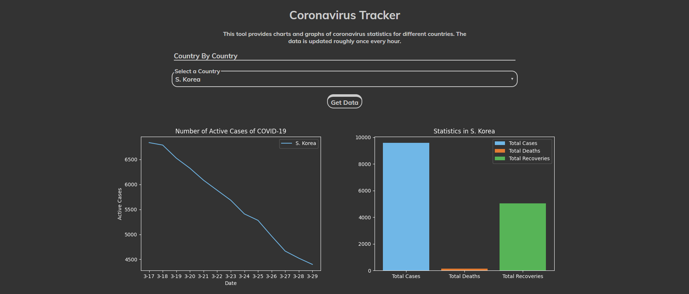
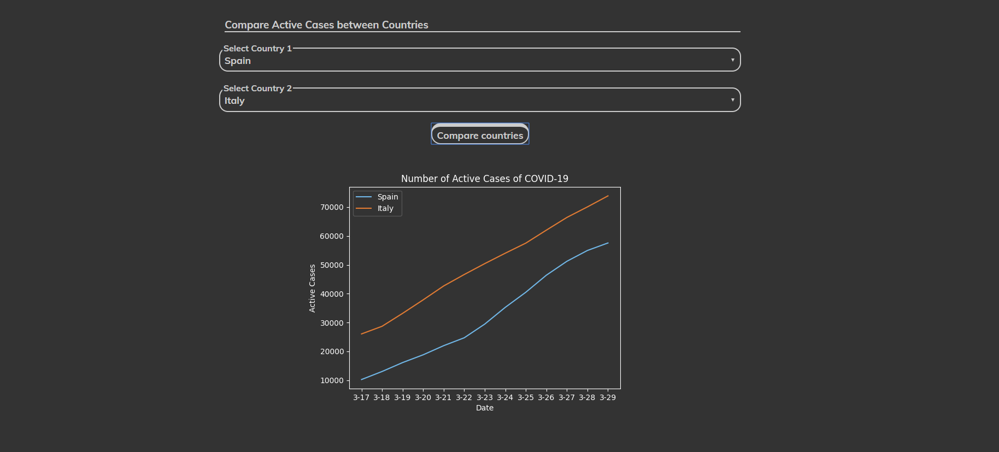

# Live Coronavirus Tracker
A live coronavirus tracking website, made with a back-end of Node.js / Python and a front-end of HTML / CSS, which tracks international data on the COVID-19 pandemic and displays it in easy to read graphics. This website was created as a collaboration with Shiva (GH: shivaganapathy) and Sam (GH: ayunami2000). I was responsible for designing the user interface for the website, managing the server side coding, as well as handeling the API calls and refactoring. The website is hosted on glitch and the link can be found [here](https://coronatracker.glitch.me/) or below.

https://coronatracker.glitch.me/

## How To Use
To use our Coronavirus tracker, simply use our drop drown and select any country you'd like, and instantly view live statistics regarding the disease in that country. We have another feature that allows the end-user to compare the amount of people with the disease in multiple countries.

(Note: All statistics of Coronavirus are updated roughly once an hour.)


## Screenshots of Website





## Repository Contents
* [server.js](https://github.com/aahmad4/Live-Coronavirus-Tracker/blob/master/server.js): This contains our first back-end programming file which was written in Node.js. This file contains the web server and assets to run the python aspect and return the images of data to the end-user.
* [server.py](https://github.com/aahmad4/Live-Coronavirus-Tracker/blob/master/server.py): This is our second back-end programming language. This file contains the logic for the server to communicate with the JavaScript and HTML. Also, this is where we have the logic written for using the Covid19 API to make our own graphs with matplotlib and distrubute them to the end-user.
* [index.html](https://github.com/aahmad4/Live-Coronavirus-Tracker/blob/master/public/index.html) and [style.css](https://github.com/aahmad4/Live-Coronavirus-Tracker/blob/master/public/style.css) in the public folder both contain the front-end of the website and that's where the user interface and overall design of the website was developed.
* The [`old` branch](https://github.com/aahmad4/Live-Coronavirus-Tracker/tree/old) contains the previously held code for the website using Rapid API. After this API went down, I transferred the code to the [Covid19API](https://covid19api.com/) and fixed a lot of the server side code. Now this new code resides in the master branch. 

## Built With

* [Python 3.7.7](https://www.python.org/)
   * [Matplotlib](https://matplotlib.org/)
   * [Requests](https://requests.readthedocs.io/en/master/)
* [Node 12](https://nodejs.org/en/)
   * [Node-fetch](https://www.npmjs.com/package/node-fetch)
* [HTML5](https://developer.mozilla.org/en-US/docs/Web/HTML)
* [CSS3](https://developer.mozilla.org/en-US/docs/Archive/CSS3)
* [Covid19API](https://covid19api.com/)

## Clone
```bash
git clone https://github.com/aahmad4/Live-Coronavirus-Tracker
```

## Implementation

In [server.js](https://github.com/aahmad4/Live-Coronavirus-Tracker/blob/master/server.js) change the `python3` command 
based on your python 3 installation.

```javascript
var execProcess = exec(
        'python3 server.py "' +
          req.url
            .substr(3)
            .toLowerCase()
            .replace(/%20/g, " ")
            .replace(/\"/g, "") +
          '"'
      );
```
## Contributing

Pull requests are welcome. For major changes, please open an issue first to discuss what you would like to change.

Please make sure to update tests as appropriate.
